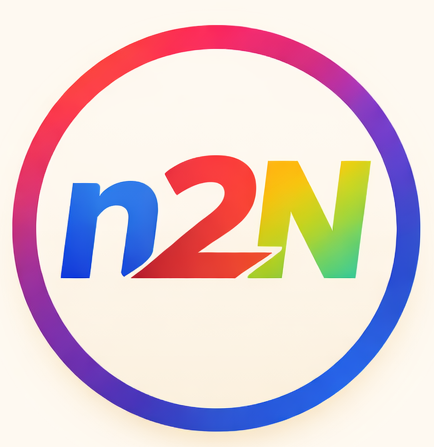

<p align="center"><a href="https://laravel.com" target="_blank"></a></p>

<p align="center">
<a href="https://github.com/laravel/framework/actions"></a>
<a href="https://packagist.org/packages/laravel/framework"></a>
<a href="https://packagist.org/packages/laravel/framework"></a>
<a href="https://packagist.org/packages/laravel/framework"></a>
</p>

## Kasir Cafe



Sistem kasir & stok bahan untuk cafe/resto dengan fitur:
- POS kasir + struk thermal 80mm
- Stok bahan dengan FEFO + batch expiry
- Resep / BOM untuk pemotongan stok otomatis
- Laporan penjualan, COGS, laba, pajak, diskon
- Refund/void parsial + stok kembali otomatis
- Multi user (admin/manager/kasir)
- Lisensi aplikasi (trial 30 hari + license key tervalidasi)
- Audit log perubahan harga & stok
- Inventaris resto + laporan kerusakan/pemusnahan

Cara membaca ringkasan di atas:

Subtotal = total sebelum diskon & pajak
Diskon = potongan uang
Pajak = 10% dari (Subtotal − Diskon)
Omzet = (Subtotal − Diskon) + Pajak
Refund = total refund pada periode
COGS (HPP) = harga pokok bahan
Laba Kotor = (Subtotal − Diskon) − COGS
→ Jadi bisa negatif kalau COGS lebih besar dari penjualan

Cara yang benar untuk kenaikan harga bahan baku:

Saat ada pembelian baru (harga 135.000/kg), input lewat Penerimaan Barang.
Sistem akan membuat batch baru dengan biaya 135.000.
COGS otomatis pakai harga sesuai batch yang dipakai (FEFO/FIFO), jadi:
Stok lama tetap pakai harga 130.000
Stok baru pakai harga 135.000
Laba jadi akurat sesuai “harga asli saat dibeli”.
Jadi bukan mengikuti harga terbaru untuk semua stok. Yang terbaik adalah pisah per batch 

Kalau kamu hanya “mengganti harga” tanpa ada pembelian baru, itu akan mengubah cost untuk stok lama dan bikin COGS jadi tidak akurat. Lebih baik selalu lewat penerimaan barang.

## FEFO vs FIFO (Pemakaian Stok)
**FEFO (First Expired, First Out)**:
Stok yang **paling cepat kadaluarsa** dipakai dulu. Cocok untuk bahan dengan expiry date (susu, daging, sayur).

**FIFO (First In, First Out)**:
Stok yang **paling lama masuk** dipakai dulu. Cocok bila tidak ada expiry atau semua batch punya umur simpan mirip.

**Di sistem ini**:
- Jika batch punya `expired_at`, maka dipakai **FEFO** (yang kadaluarsa paling cepat).
- Jika `expired_at` kosong, maka dipakai **FIFO** (yang masuk lebih dulu).

Dengan ini, COGS selalu mengikuti **biaya per batch yang benar**, bukan harga terbaru.

## Alur Kerja Sistem
1. **Input Bahan & Stok Awal**
   - Admin input bahan (item), satuan, stok awal melalui receiving/stock opname.
2. **Input Menu & Resep**
   - Admin buat produk/menu dan set resep per porsi (gram/ml/dll).
3. **Kasir Melayani Pesanan**
   - Kasir input pesanan di POS → bayar → stok bahan otomatis berkurang berdasarkan resep.
4. **Monitoring & Laporan**
   - Owner/admin cek stok, opname, penjualan, COGS, laba, pajak.
5. **Inventaris Resto**
   - Catat aset, kondisi, lokasi/kategori, serta laporan kerusakan/pemusnahan.

## Cara Install (Ambil dari GitHub)
1. Clone project:
   ```bash
   git clone https://github.com/kumbang-kobum/N2n-cofe-resto.git
   cd N2n-cofe-resto/kasir-cafe
   ```
2. Copy `.env`:
   ```bash
   cp .env.example .env
   ```
3. Set database & key:
   ```bash
   php artisan key:generate
   ```

## Cara Install (Development)
1. Install dependency:
   ```bash
   composer install
   npm install && npm run build
   ```
2. Migrasi & seed:
   ```bash
   php artisan migrate --seed
   php artisan storage:link
   ```
3. Jalankan:
   ```bash
   php artisan serve
   ```
4. (Opsional) Bersihkan cache bila perubahan tidak tampil:
   ```bash
   php artisan optimize:clear
   ```

## Cara Install (Server / Production)
1. Upload kode ke server (Nginx/Apache + PHP + MySQL) atau `git clone` dari repo.
2. Buat `.env` (copy dari `.env.example`) dan isi:
   - `APP_ENV=production`
   - `APP_DEBUG=false`
   - `APP_URL=https://domain-client.com`
   - `DB_*` sesuai server
   - `LICENSE_MASTER_KEY=...`
3. Install dependency:
   ```bash
   composer install --no-dev --optimize-autoloader
   npm install && npm run build
   ```
4. Migrasi & storage:
   ```bash
   php artisan migrate --force
   php artisan storage:link
   ```
5. Cache config/route/view:
   ```bash
   php artisan config:cache
   php artisan route:cache
   php artisan view:cache
   ```
6. Pastikan permission:
   - `storage/` dan `bootstrap/cache/` writable.
7. (Opsional) Jalankan `php artisan optimize:clear` jika perubahan belum terlihat.

## Deployment Otomatis (Server)
1. Pastikan `.env` sudah benar (`APP_ENV=production`, `APP_DEBUG=false`, `APP_URL`, `DB_*`, `LICENSE_MASTER_KEY`).
2. Jalankan script:
   ```bash
   bash scripts/deploy.sh
   ```

## Lisensi
1. Set `LICENSE_MASTER_KEY` di `.env`.
2. Login admin → **Pengaturan Resto** → copy **Installation Code**.
3. Generate license:
   ```bash
   php scripts/generate_license.php INSTALLATION_CODE MASTER_KEY
   ```
4. Input hasilnya ke **License Key** di Pengaturan Resto.

## Smoke Test POS
```bash
bash scripts/smoke_pos.sh
```

## Backup & Restore DB
Backup:
```bash
bash scripts/db_backup.sh
```

Restore:
```bash
bash scripts/db_restore.sh backups/backup_YYYYMMDD_HHMMSS.sql
```

## Inventaris & Kerusakan
Menu:
- **Inventaris**
- **Master Kategori**
- **Master Lokasi**
- **Kerusakan/Pemusnahan**

Isi master kategori & lokasi terlebih dahulu agar dropdown inventaris tersedia.

## Auto Backup 8 Jam
Lihat panduan cron:
`docs/cron_backup.md`

## About Laravel
Laravel adalah framework PHP untuk membangun aplikasi web. Dokumentasi: https://laravel.com/docs
- **[Redberry](https://redberry.international/laravel-development)**
- **[Active Logic](https://activelogic.com)**

## Contributing

Thank you for considering contributing to the Laravel framework! The contribution guide can be found in the [Laravel documentation](https://laravel.com/docs/contributions).

## Code of Conduct

In order to ensure that the Laravel community is welcoming to all, please review and abide by the [Code of Conduct](https://laravel.com/docs/contributions#code-of-conduct).

## Security Vulnerabilities

If you discover a security vulnerability within Laravel, please send an e-mail to Taylor Otwell via [taylor@laravel.com](mailto:taylor@laravel.com). All security vulnerabilities will be promptly addressed.

## License

The Laravel framework is open-sourced software licensed under the [MIT license](https://opensource.org/licenses/MIT).
